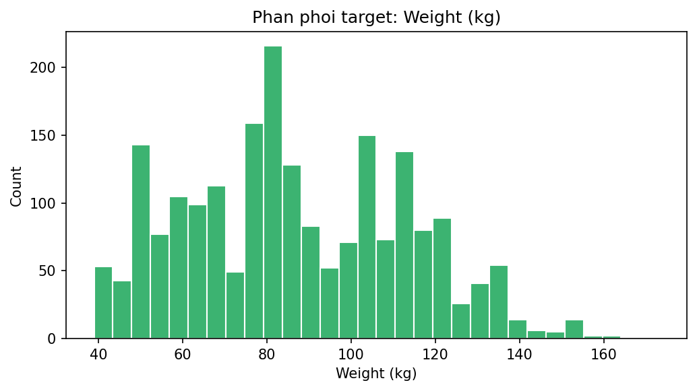
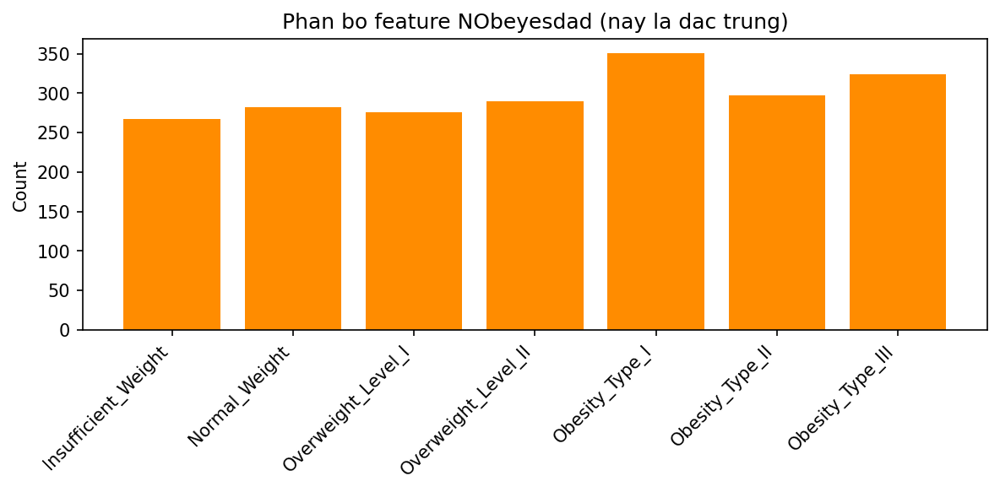
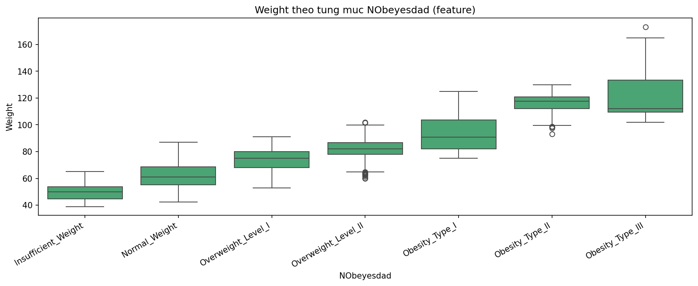
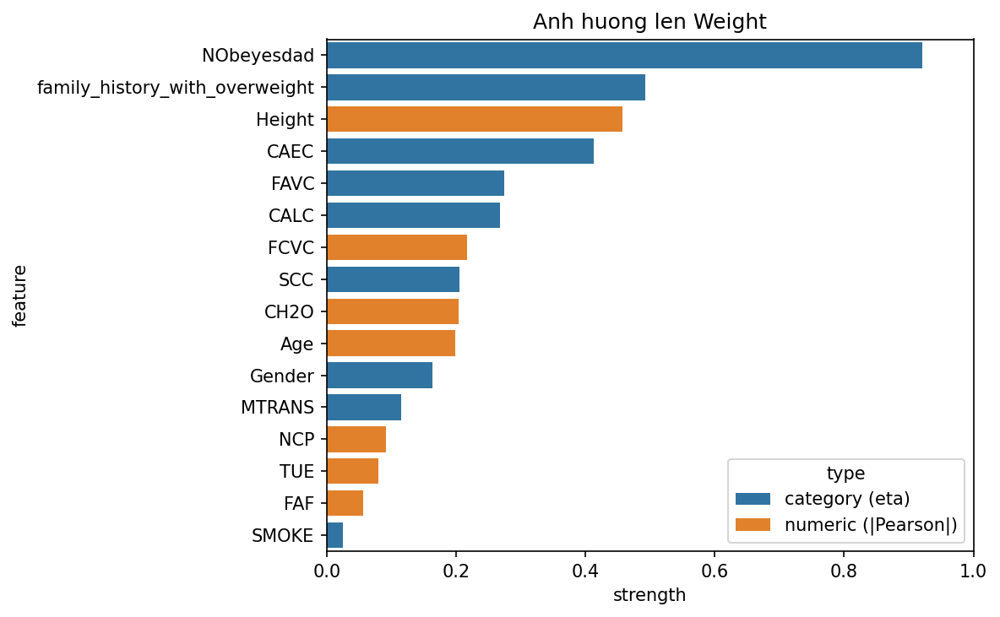
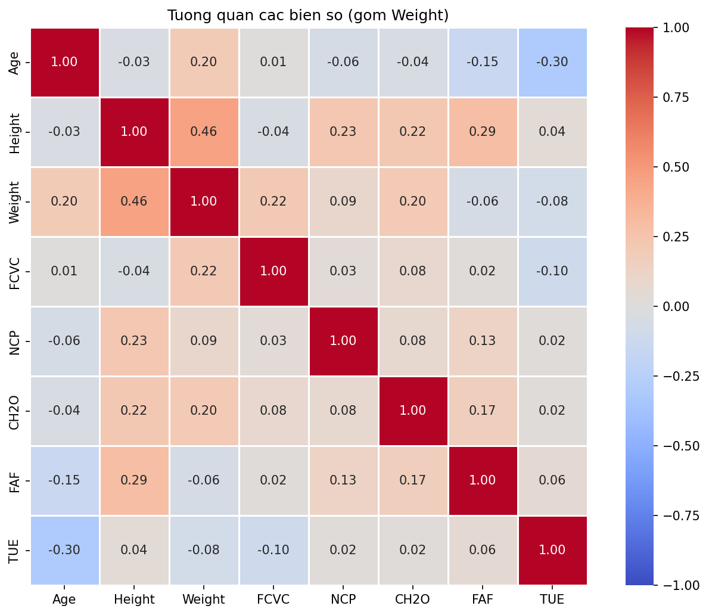
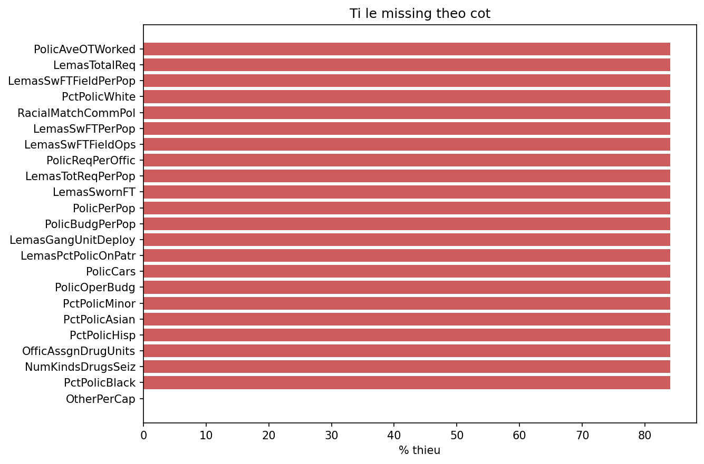
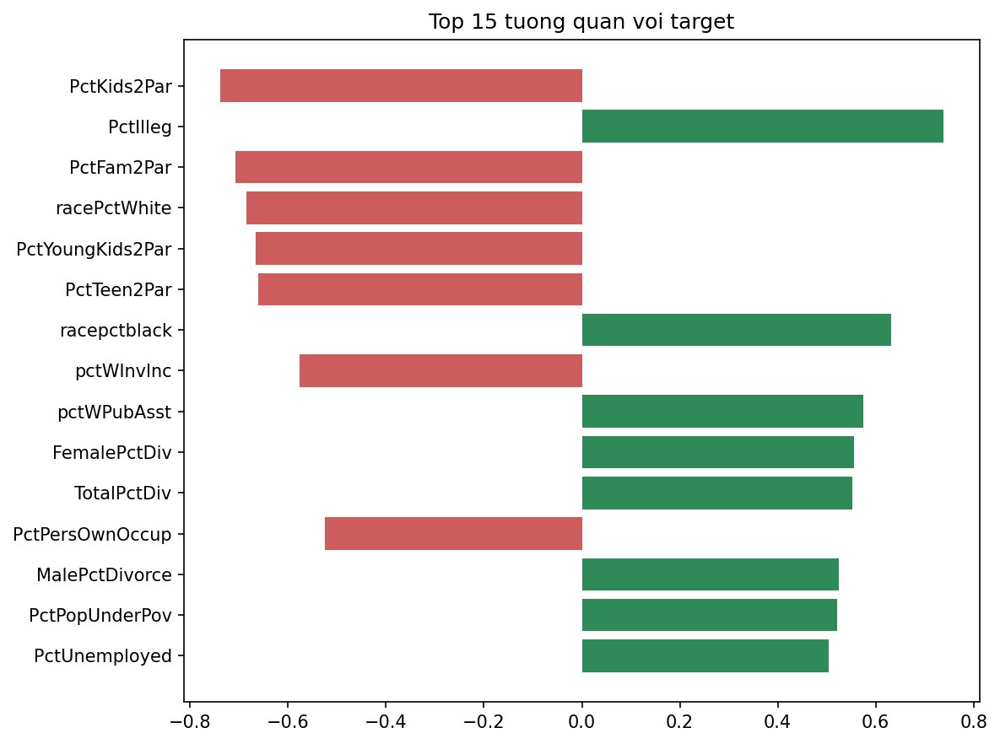
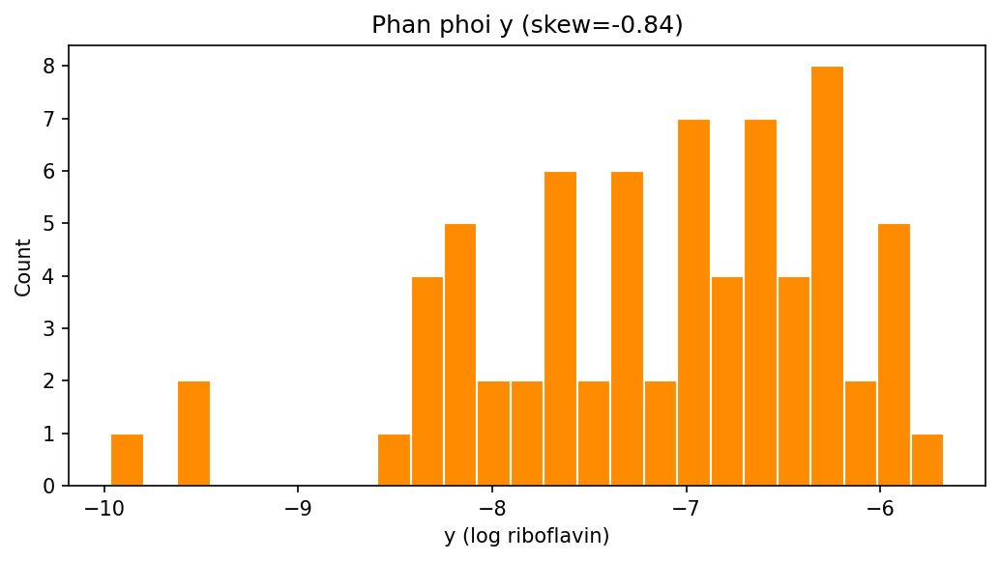
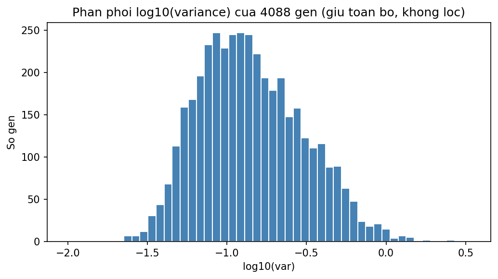
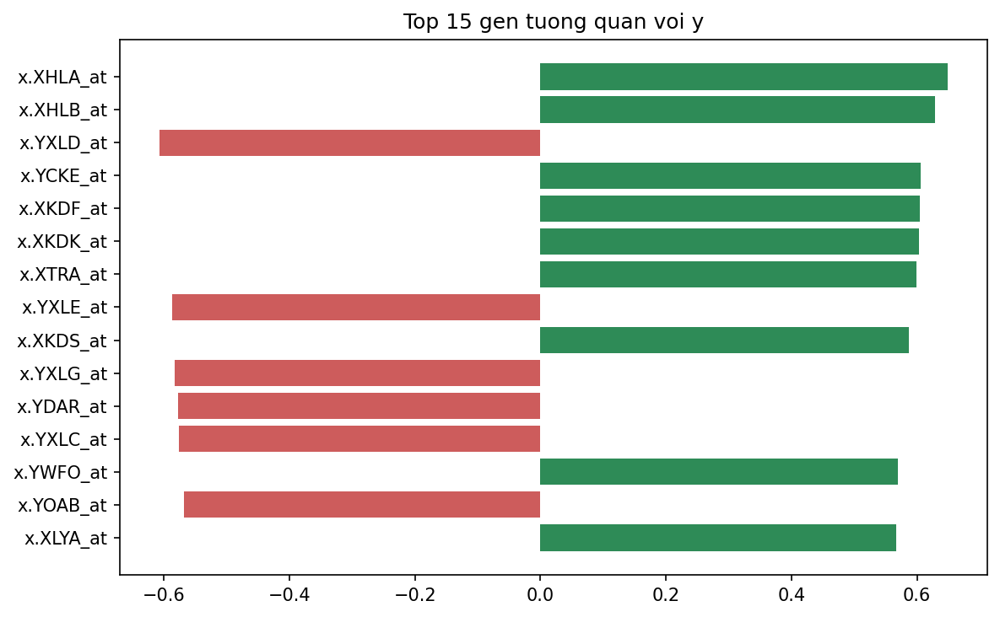

# Báo cáo EDA — 3 Dataset: Obesity · Communities&Crime · Riboflavin

> Báo cáo phân tích khám phá dữ liệu (EDA) chi tiết cho 3 bộ dữ liệu dùng trong thí nghiệm **feature selection**
> (Linear Regression / Lasso / Boruta). Số liệu lấy từ output thật của các notebook tiền xử lý
> ([preproc_obesity.ipynb](preproc_obesity.ipynb), [preproc_communities.ipynb](preproc_communities.ipynb),
> [preproc_riboflavin.ipynb](preproc_riboflavin.ipynb)). Biểu đồ nằm trong [eda_assets/](eda_assets/).

| Dataset | Bài toán | Kích thước (sau xử lý) | Đặc thù |
|---|---|---|---|
| **Obesity** | Hồi quy (target `Weight`) | 2.087 × 17 → encode 2.087 × **21** | Encode theo loại biến; `NObeyesdad`/`Height` ~ leakage |
| **Communities & Crime** | Hồi quy | 1.994 × **101** | p vừa, nhiều feature yếu + đa cộng tuyến |
| **Riboflavin** | Hồi quy | 71 × **4.089** | **p ≫ n** (gen biểu hiện), không lọc var, bắt buộc regularization |

---

# 1. Obesity (`ObesityDataSet.csv`)

**Mục tiêu:** bài toán **hồi quy** — dự đoán **cân nặng `Weight` (kg)** từ đặc trưng nhân trắc học, thói quen ăn uống
và lối sống. Biến `NObeyesdad` (mức béo phì, 7 lớp có thứ tự) vốn là nhãn phân loại của bộ gốc, **nay dùng làm feature**
(ordinal 0..6). Đây là bộ duy nhất có biến phân loại nên là nơi minh hoạ **encode theo loại biến** (binary / ordinal / one-hot).

## 1.1 Tổng quan & chất lượng dữ liệu
- **Kích thước gốc:** 2.111 dòng × 17 cột (8 số, 9 phân loại). **0 ô missing**.
- **Trùng lặp:** 24 dòng trùng (do phần dữ liệu tổng hợp SMOTE của bộ gốc) → **loại bỏ** còn **2.087 dòng**.
- **Không** có outlier lỗi: `Age` có vài giá trị cao (tới 61) nhưng là người thật; `Weight` 39–173 kg, `Height` 1,45–1,98 m.

## 1.2 Phân phối target `Weight` & phân bố feature `NObeyesdad`

Target `Weight` ∈ [39; 173] kg, mean ≈ 86,9, **gần đối xứng** (skew ≈ +0,24) → phù hợp hồi quy, không cần biến đổi.

Feature `NObeyesdad` (7 mức) phân bố **khá đều**:

| Mức | Số mẫu |
|---|---|
| Insufficient_Weight | 267 |
| Normal_Weight | 282 |
| Overweight_Level_I | 276 |
| Overweight_Level_II | 290 |
| Obesity_Type_I | 351 |
| Obesity_Type_II | 297 |
| Obesity_Type_III | 324 |

→ 267–351 mẫu/mức, không có mức quá hiếm.

## 1.3 Biến số — thống kê & độ lệch

| Biến | mean | std | min | max | skew | Ghi chú |
|---|---|---|---|---|---|---|
| Age | 24,35 | 6,37 | 14 | 61 | **+1,51** | lệch phải mạnh, đa số 20–26 tuổi |
| Height | 1,70 | 0,09 | 1,45 | 1,98 | −0,02 | gần chuẩn |
| Weight | 86,86 | 26,19 | 39 | 173 | +0,24 | gần đối xứng |
| FCVC (ăn rau) | 2,42 | 0,53 | 1 | 3 | −0,45 | thang rời rạc 1–3 |
| NCP (số bữa) | 2,70 | 0,76 | 1 | 4 | **−1,14** | tụ ở 3 bữa |
| CH2O (nước) | 2,00 | 0,61 | 1 | 3 | −0,11 | thang 1–3 |
| FAF (vận động) | 1,01 | 0,85 | 0 | 3 | +0,49 | nhiều người ít vận động |
| TUE (thời gian dùng TB) | 0,66 | 0,61 | 0 | 2 | +0,61 | thang 0–2 |

→ Các cột hành vi (`FCVC,NCP,CH2O,FAF,TUE`) bản chất **rời rạc** nhưng lưu dạng số thực → không có outlier, không cần log.

## 1.4 Biến phân loại — cardinality & mất cân bằng

| Biến | Loại | Phân bố |
|---|---|---|
| Gender | nhị phân | Male 1052 / Female 1035 — **cân bằng** |
| family_history_with_overweight | nhị phân | yes 1722 / no 365 |
| FAVC (đồ ăn nhanh) | nhị phân | yes 1844 / no 243 |
| SMOKE | nhị phân | no 2043 / **yes 44** — rất lệch |
| SCC (theo dõi calo) | nhị phân | no 1991 / yes 96 |
| CAEC (ăn vặt) | thứ bậc (4) | Sometimes 1761 / Frequently 236 / Always 53 / no 37 |
| CALC (rượu) | thứ bậc (4) | Sometimes 1380 / no 636 / Frequently 70 / **Always 1** |
| MTRANS | danh nghĩa (5) | Public 1558 / Auto 456 / Walking 55 / Motorbike 11 / Bike 7 |

## 1.5 Quan hệ với target `Weight`

Target nay là **numeric** → đo mức ảnh hưởng lên `Weight` bằng **|Pearson|** (feature số) và **η — correlation ratio**
(feature phân loại), cả hai ∈ [0,1]. **Xếp hạng ảnh hưởng lên `Weight`:**

| Hạng | Feature | Độ mạnh | Loại |
|---|---|---|---|
| 1 | **NObeyesdad** | **0,921** | category (η) |
| 2 | family_history_with_overweight | 0,493 | category (η) |
| 3 | Height | 0,457 | numeric (\|Pearson\|) |
| 4 | CAEC | 0,413 | category (η) |
| 5 | FAVC | 0,275 | category (η) |
| 6 | CALC | 0,268 | category (η) |
| 7 | FCVC | 0,217 | numeric (\|Pearson\|) |
| 8 | SCC | 0,205 | category (η) |
| … | … | … | … |
| 12 | MTRANS | 0,115 | category (η) |
| 16 | SMOKE | 0,024 | category (η) |

> ⚠️ **Cảnh báo leakage khái niệm:** `NObeyesdad` (η=0,921) và `Height` gần như **định nghĩa** `Weight` qua
> BMI = `Weight`/`Height`². Giữ `NObeyesdad` làm feature (theo yêu cầu) sẽ cho fit rất cao một cách "dễ dàng" — cần lưu ý
> khi diễn giải. Nếu muốn dự đoán `Weight` "công bằng" từ lối sống, nên cân nhắc bỏ `NObeyesdad`/`Height`; khi đó tín hiệu
> "thật" mạnh nhất là **tiền sử gia đình** (0,493), **thói quen ăn vặt/ăn nhanh** (CAEC 0,413, FAVC 0,275) và ăn rau/tuổi.

`Weight` tương quan dương **vừa** với `Height`; các biến hành vi (`FCVC`,`FAF`,`TUE`,`NCP`,`CH2O`) tương quan **yếu**
với nhau và với `Weight` → tín hiệu numeric "thật" cho `Weight` chủ yếu đến từ `Height`.

## 1.6 ⭐ Encoding — theo loại biến

**Vấn đề của one-hot với biến nhị phân:** one-hot một biến 2 mức tạo **2 cột** thoả `A + B = 1` →
**tương quan = −1 (đa cộng tuyến hoàn hảo)**; 1 cột hoàn toàn dư thừa, làm hệ số Linear/Lasso bất ổn → dùng binary mapping.

**Sơ đồ encoding:**

| Nhóm | Biến | Cách encode | Số cột |
|---|---|---|---|
| Nhị phân | Gender, family_history, FAVC, SMOKE, SCC | **0/1 (binary mapping)** | 5 |
| Thứ bậc | CAEC, CALC | ordinal `no=0<Sometimes=1<Frequently=2<Always=3` | 2 |
| Thứ bậc (feature) | NObeyesdad | ordinal 0..6 theo thứ tự mức béo | 1 |
| Danh nghĩa thuần | MTRANS (5 mức) | **one-hot giữ đủ 5 mức (không drop_first)** | 5 |
| Numeric (gồm target `Weight`) | Age, Height, Weight, FCVC, NCP, CH2O, FAF, TUE | giữ nguyên | 8 |

→ Kết quả: `obesity_encoded.csv` — **2.087 × 21 cột** (20 feature + target `Weight`), **toàn số**, không còn cặp cột
đa cộng tuyến hoàn hảo sinh từ biến nhị phân.

---

# 2. Communities & Crime (`communities.data`)

**Mục tiêu:** hồi quy `ViolentCrimesPerPop` (tỉ lệ tội phạm bạo lực, chuẩn hoá [0,1]). **Toàn biến số** → không có encoding.

## 2.1 Tổng quan & làm sạch
- **Gốc:** 1.994 dòng × 128 cột (gần như toàn `float64` chuẩn hoá [0,1]; chỉ `communityname` là chuỗi).
- **Bỏ 5 cột định danh:** `state, county, community, communityname, fold` → còn 123 cột.
- Sau làm sạch: **1.994 × 101** (100 feature + target), **0 missing**.

## 2.2 Phân tích missing — *lệch hẳn về nhóm cảnh sát*

- **23 cột có missing**, trong đó **22 cột thiếu ~84%** (1.675/1.994 ô) — gần như toàn nhóm chỉ số cảnh sát
  (`PolicPerPop, PolicBudgPerPop, RacialMatchCommPol, LemasSwFT*`, …).
- → Điền cho cột thiếu 84% là **bịa dữ liệu** → **bỏ hẳn 22 cột**.
- `OtherPerCap` chỉ thiếu **1 ô** → điền median. Target **không thiếu**.

## 2.3 Phân phối target & tương quan

- Target **lệch phải mạnh (skew = 1,52)**: mean 0,238, median 0,15 — nhiều cộng đồng tội phạm thấp, đuôi cao thưa.

**Tương quan dương mạnh nhất:**

| Feature | corr |
|---|---|
| PctIlleg (tỉ lệ sinh ngoài giá thú) | +0,738 |
| racepctblack | +0,631 |
| pctWPubAsst (hộ nhận trợ cấp) | +0,575 |
| FemalePctDiv / TotalPctDiv | +0,556 / +0,553 |

**Tương quan âm mạnh nhất:**

| Feature | corr |
|---|---|
| PctKids2Par (trẻ sống với 2 cha mẹ) | −0,738 |
| PctFam2Par | −0,707 |
| racePctWhite | −0,685 |
| PctYoungKids2Par / PctTeen2Par | −0,666 / −0,662 |

→ Tín hiệu mạnh nhất là **cấu trúc gia đình & nhân khẩu**.

## 2.4 Đặc điểm quan trọng cho feature selection
- **18/100 feature có |corr| < 0,1** (yếu, gần nhiễu) → đây là phần Lasso/Boruta có thể loại.
- **49 cặp feature có |corr| > 0,9** (đa cộng tuyến nặng), ví dụ:
  - `PctRecImmig8 ~ PctRecImmig10` = 0,996
  - `OwnOccLowQuart ~ OwnOccMedVal` = 0,994
  - `population ~ numbUrban` = 0,993
- → Linear Regression "full" sẽ có hệ số bất ổn → **bộ này rất hợp** để chứng minh giá trị của regularization / selection.
  Feature đã chuẩn hoá [0,1] nhưng vẫn nên `StandardScaler` cho Lasso để phạt công bằng.

---

# 3. Riboflavin (`riboflavin_dataset.csv`)

**Mục tiêu:** hồi quy `y` (log sản lượng riboflavin) từ **biểu hiện gen**. Bài toán kinh điển **p ≫ n**.

## 3.1 Tổng quan & chất lượng
- **Kích thước:** 71 mẫu × 4.089 cột (1 target + **4.088 gen**), **toàn `float64`**.
- **Tỉ lệ p/n ≈ 57,6** — số feature gấp ~58 lần số mẫu.
- **0 missing, 0 dòng trùng** → dữ liệu microarray sạch sẵn.

## 3.2 Phân phối target `y`

- Khoảng **[−9,97; −5,67]**, mean −7,16, std 0,92, **lệch trái nhẹ (skew = −0,84)**, không outlier cực đoan → giữ nguyên target.

## 3.3 Phương sai gen & tương quan với target

- **Phương sai gen:** min 0,0099 — median 0,132 — max 3,40. Không có gen phương sai = 0, nhóm đuôi trái gần như hằng số.
- **Tương quan với `y`:** gen mạnh nhất chỉ đạt **|corr| ≈ 0,65** (`x.XHLA_at, x.XHLB_at, x.YXLD_at, x.YCKE_at`, …).
- **43% gen (1.757/4.088) có |corr| < 0,1** → tín hiệu chỉ nằm ở **một nhúm nhỏ gen**; phần lớn là nhiễu.

## 3.4 Tiền xử lý & hệ quả mô hình
- **Không lọc gen phương sai thấp** (theo yêu cầu) → giữ **toàn bộ 4.088 gen**, `riboflavin_processed.csv` = **71 × 4.089**.
  Việc loại gen nhiễu để cho bước **lựa chọn đặc trưng** (Lasso/Boruta) đảm nhiệm.
- **p ≫ n** (p/n ≈ 57,6) → thông điệp không đổi:
  - **OLS full sẽ overfit hoàn hảo** (train R² = 1,0 do nội suy ~56 mẫu bằng hàng nghìn feature).
  - **Bắt buộc feature selection / regularization** (Lasso, Boruta).
  - **Luôn báo cáo cross-validation:** n=71, một lần split (test 15 mẫu) dao động rất mạnh theo seed.

---

# 4. Tổng kết & khuyến nghị

| Tiêu chí | Obesity | Communities | Riboflavin |
|---|---|---|---|
| Bài toán | Hồi quy (`Weight`) | Hồi quy | Hồi quy |
| n × p (sau xử lý) | 2.087 × 20 feat | 1.994 × 100 feat | 71 × 4.088 feat |
| Missing | 0 | điền/bỏ (22 cột) | 0 |
| Vấn đề chính | leakage `NObeyesdad`/`Height`; encode biến phân loại | feature yếu + đa cộng tuyến | **p ≫ n**, overfit |
| Xử lý đặc thù | bỏ trùng + encode theo loại biến | bỏ cột thiếu 84% + median | giữ toàn bộ gen (không lọc var) |
| Phù hợp để test | Boruta/Lasso trên dữ liệu hỗn hợp | Lasso/RFE vs LR full | Lasso/Boruta + CV bắt buộc |

**Khuyến nghị chung:**
1. **Obesity** — dùng `obesity_encoded.csv` (21 cột). Cân nhắc bỏ `NObeyesdad`/`Height` nếu mục tiêu là dự đoán `Weight` từ lối sống.
2. **Communities** — `StandardScaler` + Lasso để xử lý 18 feature nhiễu và 49 cặp đa cộng tuyến.
3. **Riboflavin** — ưu tiên **dự đoán bằng chính Lasso (regularized)**, tránh refit OLS trần trên feature đã chọn; báo cáo CV nhiều seed.
